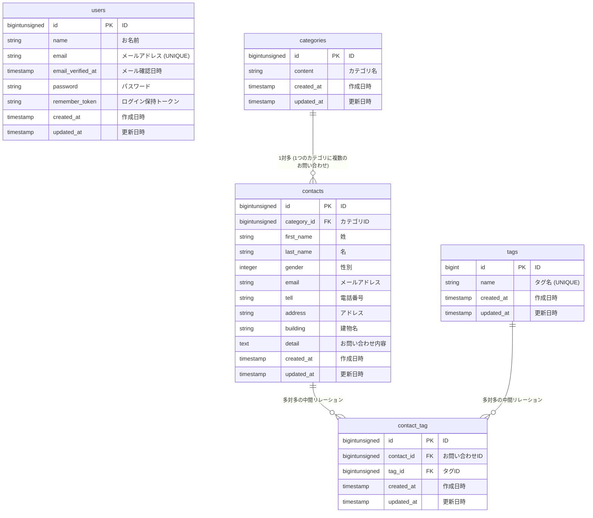

# COACHTECH お問い合わせフォーム

## 概要
確認テストを通して、教材で学んだバックエンド技術（Laravel, DB設計, テスト）を実践的にアウトプットし、復習箇所を洗い出す為に取り組みました。
- ER図を作成し、リレーションを確認。モデルとマイグレーションを作成。seederとfactoryを使いマイグレーション実行
- お問合わせフォームController作成(ContactController)(ContactRequestでバリデーション)
- 管理画面Controller作成(AdminController)(IndexContactRequest,StoreTagRequest,UpdateTagRequestでバリデーション)
- プレフィックスをまとめ、グループに設定しroute定義
- 公開API実装(Controller,Resource,api.phpを作成)PostmanでOK確認
- テスト(FeatureとUnitに分けてTest.phpを作成)全テストがpassする事を確認

## ER図

##　環境構築手順
- Laravelプロジェクトの作成 (Laravel 10.x)
- Laravel Sailのインストール
- .env ファイルの設定
- フロントエンドのセットアップ (Vite & Tailwind CSS)
- phpMyAdminの追加
- Sailの起動とエイリアス設定
- アプリケーションキーの生成
- データベースのマイグレーションと初期データ投入

## 使用技術
- Laravel 10, MySQL 8.0, Nginx, Docker

## APIエンドポイント一覧
- GET	   /api/v1/contacts	            お問い合わせ一覧（検索・ページネーション付き）
- GET	   /api/v1/contacts/{contact}	お問い合わせ詳細（カテゴリ・タグ含む）
- POST	   /api/v1/contacts	            お問い合わせ新規作成
- PUT	   /api/v1/contacts/{contact}	お問い合わせ更新
- DELETE   /api/v1/contacts/{contact}	お問い合わせ削除

## 開発環境URL
- http://localhost 

## 作成者
- 竹内麻耶